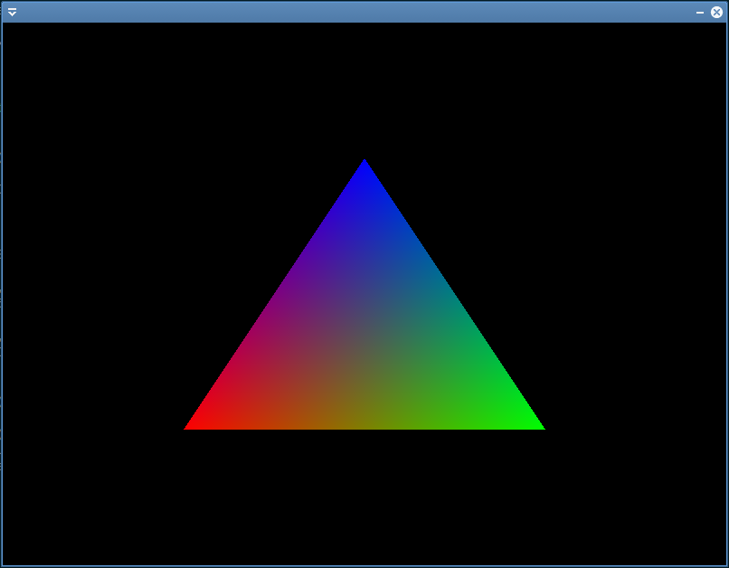

import ToDo from "@site/src/components/ToDo"

## TP3 : Hello Triangle !



Commençons par jeter un œil au code de base du fichier `TP3_exo1_triangle_blanc/main.cpp`.

```cpp
#include "p6/p6.h"

int main()
{
    auto ctx = p6::Context{{1280, 720, "TP3 EX1"}};
    ctx.maximize_window();

    /*********************************
     * HERE SHOULD COME THE INITIALIZATION CODE
     *********************************/

    // Declare your infinite update loop.
    ctx.update = [&]() {
        /*********************************
         * HERE SHOULD COME THE RENDERING CODE
         *********************************/
    };

    // Should be done last. It starts the infinite loop.
    ctx.start();
}
```

Comme vous pouvez le constater le code est assez court. La classe `p6::Context` se charge de gérer tous les détails pour nous : ouverture de fenêtre, récupération d'évènements clavier-souris, etc. Ainsi les lignes :

```cpp
auto ctx = p6::Context{{1280, 720, "TP3 EX1"}};
ctx.maximize_window();
```

vont ouvrir une fenêtre maximisée dont le titre est "TP3 EX1".

Pour les TPs, vous devrez placer le code d'initialisation à cet endroit :

```cpp
/*********************************
 * HERE SHOULD COME THE INITIALIZATION CODE
 *********************************/
```

Ensuite vient le code de la boucle d'application :

```cpp
ctx.update = [&]() {
    /*********************************
     * HERE SHOULD COME THE RENDERING CODE
     *********************************/
};
```

On passe [une lambda](https://julesfouchy.github.io/Learn--Clean-Code-With-Cpp/lessons/lambda/) au contexte p6 ; ce dernier s'occupera de l'appeler quand il faut (en boucle, 60 fois par seconde).<br/>
C'est là que vous mettrez votre code de rendu et d'animation.

C'est aussi en passant des lambdas au contexte que vous pourrez [réagir aux différentes évènements clavier-souris](https://julesfouchy.github.io/p6-docs/tutorials/events) (`ctx.mouse_pressed`, `ctx.key_released`, etc.).

Ce code est la base de toute application multimédia interactive. Il est donc important de bien comprendre sa structure. 