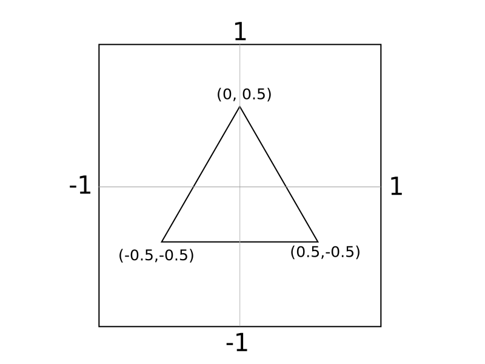
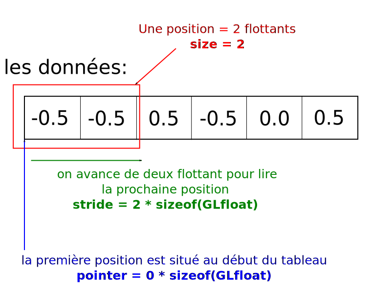
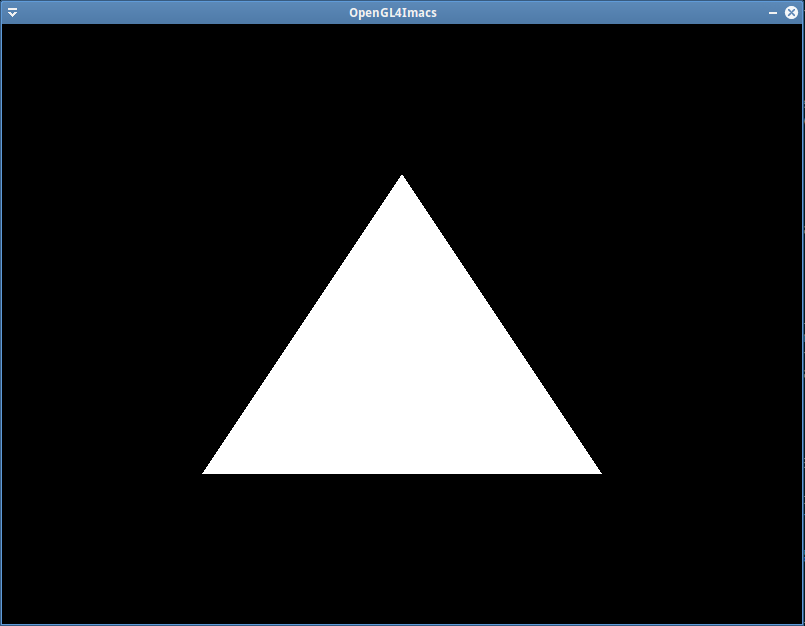

Tout d'abord, un peu de pratique. Afin de se mettre dans le bain, vous allez dessiner un triangle blanc en 2D. Cela vous permettra de voir différents concepts OpenGL3 liés à la gestion de données : les Vertex Buffer Objects (VBO) et les Vertex Array Objects (VAO). Je vous guiderai étape par étape tout en vous fournissant des liens vers la documentation pour chaque fonction utilisée. La lecture de cette dernière n'est pas optionnelle (même si c'est un peu chiant).

:::tip
Pour cet exercice, évitez de copier-coller le code de cette page : recopiez le manuellement. Ça peut paraître un peu idiot, mais cela permet de mémoriser plus facilement les fonctions à utiliser et mieux intégrer l'enchaînement des opérations.
:::

Vous coderez dans le `main.cpp` du dossier `TP3_exo1_triangle_blanc`. Au cours de l'exercice, pensez à compiler régulièrement pour vérifier les erreurs de syntaxe au fur à mesure.

:::tip
Faites attention à bien sélectionner la bonne target de l'exercice que vous êtes en train de faire !

:::

## Le VBO

Un **Vertex Buffer Object** (VBO) est un tableau (buffer) stocké sur GPU (la carte graphique) destiné à contenir des sommets de triangle (sommmet = vertex en anglais). En OpenGL on dessine tout avec des triangles (ou éventuellement des points et lignes, mais pas plus !). Un vertex est décrit par des **attributs** de sommet qui peuvent être par exemple sa position, sa normale, ses coordonnées de texture, sa couleur, etc. En pratique un attribut est juste un ensemble de nombres flottants. Une position 2D est décrite par deux flottants, une position 3D par trois flottants, une couleur par trois flottant également (rouge, vert, bleu), etc.

:::info
Les instructions qui suivent sont à coder dans la partie **Initialisation** du template, à la place du premier gros bloc de commentaires.
:::

### Création du VBO

Tout d'abord il faut créer le VBO en utilisant la fonction `glGenBuffers`. Chaque VBO sera identifié par un entier strictement supérieur à 0 qui nous sera renvoyé par OpenGL. La fonction a pour prototype :

```cpp
glGenBuffers(GLsizei n, GLuint* buffers)
```

Paramètres:

- `GLsizei n` : le nombre de VBOs à créer.
- `GLuint* buffers` : un pointeur vers un tableau d'entiers. OpenGL le remplit avec les identifiants des VBOs créés. Si on créé un seul VBO (cas n = 1), on peut juste passer l'addresse d'une variable.

Exemples d'utilisation :

```cpp
// Création d'un seul VBO :
GLuint vbo;
glGenBuffers(1, &vbo);
// À partir de ce point, la variable vbo contient l'identifiant d'un VBO
```

```cpp
// Création de plusieurs VBOs
GLuint vbos[16];
glGenBuffers(16, vbos);
// À partir de ce point, le tableau vbos contient 16 identifiants de VBO
```

Créez une variable `vbo` de type `GLuint` et utilisez la fonction présentée ci-dessus pour la remplir avec l'identifiant d'un VBO créé par OpenGL.

[glGenBuffers](https://www.khronos.org/registry/OpenGL-Refpages/gl4/html/glGenBuffers.xhtml)

### Binding du VBO

OpenGL est basé sur le concept un peu particulier de **binding**. Pour modifier le VBO créé (le remplir avec des données) il faut le **binder sur une cible**. On applique ensuite les opérations de modification en spécifiant la cible sur laquelle est bindée le VBO.

Il existe plusieurs cibles de binding pour les buffers OpenGL, identifiés par des constantes (`GL_ARRAY_BUFFER`, `GL_ELEMENT_ARRAY_BUFFER`, `GL_UNIFORM_BUFFER`, etc.). Chaque cible est destinée à un usage particulier, et on utilise la cible `GL_ARRAY_BUFFER` pour les VBOs.

Le binding peut être apparenté à un mécanisme de branchement : on branche un buffer sur une cible, ce qui nous permet de le modifier.

Pour binder un buffer, on utilise la fonction :

```cpp
glBindBuffer(GLenum target, GLuint buffer)
```

Paramètres :

- `GLenum target` : le nom de la cible, sous la forme d'une constante OpenGL.
- `GLuint buffer` : le buffer à binder.

Exemple d'utilisation:

```cpp
// Binding d'un VBO sur la cible GL_ARRAY_BUFFER:
glBindBuffer(GL_ARRAY_BUFFER, vbo);
// On peut à présent modifier le VBO en passant par la cible GL_ARRAY_BUFFER
```

Bindez le buffer `vbo` sur la cible `GL_ARRAY_BUFFER`.

[glBindBuffer](https://www.khronos.org/registry/OpenGL-Refpages/gl4/html/glBindBuffer.xhtml)

### Remplir le VBO

Maintenant que le VBO est bindé, on peut le modifier. Il faut envoyer les données de nos sommets à la carte graphique pour qu'elles soient placées dans le VBO.

On veut dessiner un triangle au centre de l'écran. Par défaut l'écran représente l'espace 2D allant de -1 à 1 sur chacun des axes. On veut donc stocker les points $P_1 = (-0.5, -0.5)$, $P_2 = (0.5, -0.5)$ et $P_3 = (0.0, 0.5)$.

<div class="white-background">



</div>

Il faut commencer par créer un tableau de `GLfloat` contenant toutes ces coordonnées à la suite :

```cpp
GLfloat vertices[] = {
    -0.5f, -0.5f,
     0.5f, -0.5f,
     0.0f,  0.5f
};
```

L'envoi des données se fait ensuite avec la fonction :

```cpp
glBufferData(GLenum target, GLsizeiptr size, const GLvoid* data, GLenum usage)
```

Paramètres :

- `GLenum target` : la cible sur laquelle le buffer est bindé (`GL_ARRAY_BUFFER` dans notre cas).
- `GLsizeiptr size` : la taille du tableau en **octets**. C'est le nombre de flottants multiplié par la taille d'un float (`sizeof(GLfloat)`).
- `const GLvoid* data` : le pointeur vers les données, notre tableau de flottants.
- `GLenum usage` : un flag indiquant à OpenGL quel usage on va faire du buffer. On utilise `GL_STATIC_DRAW` pour un buffer dont les données ne changeront jamais.

Exemple d'utilisation :

```cpp
GLfloat vertices[] = {
    -0.5f, -0.5f, // Premier sommet
     0.5f, -0.5f, // Deuxième sommet
     0.0f,  0.5f  // Troisième sommet
};
glBufferData(GL_ARRAY_BUFFER, 6 * sizeof(GLfloat), vertices, GL_STATIC_DRAW);
```

À l'aide de la fonction présentée ci dessus, remplir le VBO avec les données du tableau `vertices`.

[glBufferData](https://www.khronos.org/registry/OpenGL-Refpages/gl4/html/glBufferData.xhtml)

### Débinder le VBO

Après avoir modifié le VBO, on le débind de la cible pour éviter de le remodifier par erreur. Pour cela on utilise à nouveau la fonction `glBindBuffer` en lui passant la même cible, et 0 en second paramètre (0 représente le VBO "null").

Débindez le VBO de la cible `GL_ARRAY_BUFFER`.

[glBindBuffer](https://www.khronos.org/registry/OpenGL-Refpages/gl4/html/glBindBuffer.xhtml)

## Le VAO

Les données de vertex sont à présent stockées sur le GPU. On pourrait penser qu'on peut à présent dessiner, ou pas ! Votre GPU est très fort, mais il ne sait pas interpréter tout seul les données contenues dans le tableau. Dans notre cas on l'a rempli avec 3 sommets de deux composantes chacun (donc 6 nombres flottants). Mais si on avait voulu faire de la 3D, chaque sommet aurait 3 composantes (soit 9 flottants). Si en plus on voulait associer une couleur à chaque sommet, on aurait 3 flottant de plus par sommet. Tout ça il faut l'indiquer à OpenGL. Il faut lui expliquer comment interpréter les données. C'est ce qu'on appelle la **spécification de sommet (vertex specification)**.

La spécification de sommet se fait à l'aide d'un **Vertex Array Object (VAO)**. Un VAO décrit pour chaque attribut de sommet (position, couleur, normale, etc.) la manière dont ils sont rangés dans un ou plusieurs VBOs.

### Création du VAO

La création d'un VAO est similaire à celle d'un VBO. La fonction à utiliser est :

```cpp
glGenVertexArrays(GLsizei n, GLuint *arrays)
```

Les paramètres sont similaires à `glGenBuffers`, je ne les décris donc pas.

Crééz une variable `vao` de tye `GLuint` et utilisez la fonction présentée ci-dessus pour la remplir avec l'identifiant d'un VAO créé par OpenGL.

[glGenVertexArray](https://www.khronos.org/registry/OpenGL-Refpages/gl4/html/glGenVertexArray.xhtml)

### Binding du VAO

Impression de déjà-vu ? Normal, en OpenGL tout se bind ! Les VBOs, les VAOs, les textures, etc. Il faut donc binder le VAO en utilisant la fonction :

```cpp
glBindVertexArray(GLuint array)
```

Comme vous pouvez le constater, cette fonction ne prend pas de cible en paramètre (contrairement à `glBindBuffer`). Cela est dû au fait qu'il n'y a qu'une seule cible pour les VAOs. Celle-ci n'a pas de nom, on ne spécifie donc rien. Il ne peut donc y avoir qu'un seul VAO bindé à la fois.

Bindez le VAO créé précédement.

[glBindVertexArray](https://www.khronos.org/registry/OpenGL-Refpages/gl4/html/glBindVertexArray.xhtml)

### Activation des attributs de vertex

Chaque attribut (position, couleur, etc. (je le répète à chaque fois pour que la signification de "attribut" rentre bien dans votre crâne.)) est identifié par un entier. Par défaut, l'attribut **position** est identifié par 0. Cela peut changer lorsque l'on commence à utiliser des shaders (TP suivant).

Afin d'indiquer à OpenGL qu'on utilise un attribut donné, on utilise la fonction :

```cpp
glEnableVertexAttribArray(GLuint index)
```

Paramètres:

- `GLuint index` : l'index de l'attribut à activer

:::caution
L'appel à cette fonction modifie le VAO actuellement bindé, elle enregistre l'information "attribut [index] activé" dans le VAO. Cela signifie que si vous n'avez pas bindé de VAO, une erreur sera générée par OpenGL. **Si vous avez bindé un mauvais VAO** (par la suite on utilisera plusieurs VAOs), alors vous vous exposez à un bug très difficile à trouver et à corriger.
:::

En utilisant la fonction, activer l'attribut position, c'est à dire l'index 0.

[glEnableVertexAttribArray](https://www.khronos.org/registry/OpenGL-Refpages/gl4/html/glEnableVertexAttribArray.xhtml)

Afin d'avoir un code plus clair, on introduit souvent des constantes pour identifier les attributs de vertex. Au lieu de simplement faire :

```cpp
glEnableVertexAttribArray(0);
```

On fera plutôt :

```cpp
static constexpr GLuint vertex_attr_position = 0;
glEnableVertexAttribArray(vertex_attr_position);
```

De cette manière on comprend immédiatement que le 0 correspond à l'attribut de sommet identifiant la position.

:::tip
La notion d'attribut de sommet peut vous paraitre abstraite pour le moment car on utilise qu'un seul attribut (la position). Pas de panique, ça deviendra plus clair quand on introduira les autres attributs, tel que la couleur dans l'exercice suivant.<br/>
Il est important de bien comprendre que l'index associé à un attribut de vertex n'est qu'un identifiant. Ce n'est en aucun cas un index de tableau ou quoi que ce soit de cette sorte. Par la suite on choisira nous même l'index associé à chaque attribut.
:::

### Spécification des attributs de vertex

On doit ensuite indiquer à OpenGL où il va trouver les sommets à dessiner, et comment lire les informations associées à chaque sommet. Pour cela on va utiliser la fonction `glVertexAttribPointer`. Celle-ci fait beaucoup de choses à la fois et est assez compliquée à maîtriser correctement.

Le prototype de la fonction est :

```cpp
glVertexAttribPointer(GLuint index, 
    GLint size, GLenum type, GLboolean normalized, 
    GLsizei stride, const GLvoid* pointer);
```

Paramètres :

- `GLuint index` : l'index de l'attribut à spécifier.
- `GLint size` : le nombre de composantes de l'attribut. Dans notre cas c'est 2 car chaque position est décrite par deux nombres flottants.
- `GLenum type` : une constante OpenGL indiquant le type de chaque composante. Dans notre cas on passe `GL_FLOAT` pour indiquer que chaque composante est un nombre flottant.
- `GLboolean normalized` : pas besoin de s'occuper de ce paramètre pour le moment, on passe `GL_FALSE`
- `GLsizei stride` : indique à OpenGL le nombre d'octets séparant l'attribut pour deux sommets consécutifs. Ça ne veut rien dire ? oui je sais. Imaginez vous être OpenGL. Vous venez de lire une position dans le tableau. Vous avez besoin de savoir où est située la position suivante. Dans notre cas elle est juste après, il faut donc avancer de deux flottants, soit `2 * sizeof(GLfloat)` octets. Nous verrons dans l'exercice suivant que la position suivante peut être située plus loin dans le tableau lorsqu'on rajoute des attributs de sommet.
- `const GLvoid* pointer` : un pointeur, ou pas. Ce paramètre est un piège. Il faut en fait passer l'offset (décalage) en octets de la premiere instance de l'attribut dans le tableau. OK, ça ne veut encore rien dire. Dans notre cas, la première position est située au début du tableau, l'offset est donc 0.

Voici un schéma pour vous aider à comprendre les paramètres de la fonction :

<div class="white-background">



</div>

Tout ça c'est bien joli, mais il faut également indiquer à OpenGL quel VBO il doit utiliser. Dans notre cas on n'a qu'un seul VBO donc ça paraît bizarre, mais on pourrait très bien en avoir 42 contenant des millions de triangles. Il faut qu'OpenGL puisse stocker dans le VAO une référence vers le VBO contenant les données. **Le VBO contient les données et le VAO décrit les données**.

Pour cela, il suffit de binder le VBO sur la cible `GL_ARRAY_BUFFER` juste avant d'appeler la fonction `glVertexAttribPointer`. La fonction s'occupe d'aller lire l'identifiant du VBO bindé sur la cible et de le stocker dans le VAO.

Bindez à nouveau le VBO sur la cible `GL_ARRAY_BUFFER`.

Utilisez la fonction `glVertexAttribPointer` pour spécifier le format de l'attribut de sommet position.

Débindez le VBO de la cible `GL_ARRAY_BUFFER`.

[glVertexAttribPointer](https://www.khronos.org/registry/OpenGL-Refpages/gl4/html/glVertexAttribPointer.xhtml)

### Débinder le VAO

Il reste à débinder le VAO afin de ne pas le modifier par erreur.

Débindez le VAO en utilisant la fonction `glBindVertexArray`. Pour cela, passez lui 0 en paramètre.

## Le dessin du triangle

L'initialisation est terminée, il est temps de passer au dessin.

:::info
Les instructions qui suivent sont à coder dans la partie **Rendu** du template, à la place du deuxième gros bloc de commentaires.
:::

### Nettoyer la fenêtre

Le code de dessin est répété à chaque tour de la boucle d'application. Il faut donc d'abord nettoyer la fenêtre afin de ne pas avoir de résidu du tour précédent. Pour cela on utilise la fonction

```cpp
glClear(GLbitfield mask)
```

Paramètres :

- `GLbitfield mask` : une combinaison de flags indiquant à OpenGL ce qu'il doit nettoyer dans la fenêtre. Pour l'instant on utilise `GL_COLOR_BUFFER_BIT` uniquement.

Dans la boucle principale, nettoyez la fenêtre en utilisant `glClear`.

[glClear](https://www.khronos.org/registry/OpenGL-Refpages/gl4/html/glClear.xhtml)

### Dessiner en utilisant le VAO

Le dessin se fait en utilisant un **draw call**, c'est à dire une fonction OpenGL qui lance le pipeline sur un ensemble de sommets spécifiés par un VAO. Il faut donc commencer par re-binder le VAO.

Bindez à nouveau le VAO en utilisant `glBindVertexArray`.

On utilise ensuite la fonction :

```cpp
glDrawArrays(GLenum mode, GLint first, GLsizei count)
```

Paramètres:

- `GLenum mode` : le type de primitive à dessiner, dans notre cas `GL_TRIANGLES`
- `GLint first` : l'indice du premier sommet dans le VBO. On passe 0.
- `GLsizei count` : le nombre de sommets à dessiner, on passe 3 car on veut dessiner un triangle qui est composé de 3 sommets. Si on voulait dessiner plus de triangles il faudrait changer ce paramètre.

Utilisez cette fonction pour dessiner le triangle.

[glDrawArrays](https://www.khronos.org/registry/OpenGL-Refpages/gl4/html/glDrawArrays.xhtml)

À nouveau, débindez le VAO pour ne pas risquer de le modifier par erreur dans le reste du code.

## La libération des ressources

On y est presque ! Il reste à libérer les ressources allouées sur GPU : le VBO et le VAO. Pour cela on utilise les fonctions `glDeleteBuffers` et `glDeleteVertexArrays` dont les paramètres sont similaires à ceux des fonctions de création (voir la doc).

À la toute fin du programme, après `ctx.start()`, utilisez les fonctions de libération des ressources pour désallouer le VBO et le VAO.

[glDeleteBuffers](https://www.khronos.org/registry/OpenGL-Refpages/gl4/html/glDeleteBuffers.xhtml)<br/>
[glDeleteVertexArrays](https://www.khronos.org/registry/OpenGL-Refpages/gl4/html/glDeleteVertexArrays.xhtml)

## Conclusion

Exercice terminé ! C'était long, mais nécessaire car si vous avez bien compris chacune des étapes alors vous avez fait le plus dur en OpenGL3 côté CPU (c'est à dire du côté du code C++). Vous pouvez essayer votre programme et un triangle blanc devrait s'afficher ... enfin peut-être ! En fait il nous manque une étape (les shaders). Avec un peu de chance votre carte graphique propose un shader par défaut, mais ce n'est pas garanti ! Si vous ne voyez rien, vous pouvez include le fichier `glimac/default_shader.hpp` et appeler `glimac::bind_default_shader();` juste avant la fonction `glDrawArrays`.



Un petit récapitulatif des étapes effectuées pour dessiner le triangle :

- Initialisation :
  - Création du VBO
  - Binding du VBO
  - Envoi des données de vertex
  - Débinding du VBO
  - Création du VAO
  - Binding du VAO
  - Activation de l'attribut de sommet 0 (la position)
  - Spécification de l'attribut de sommet 0
  - Débinding du VAO
- Dessin :
  - Binding du VAO
  - Appel à la fonction de dessin
  - Débinding du VAO
- Libération des resources

Ça peut paraitre long pour dessiner juste un triangle, mais il est important de constater que la taille de ce code ne dépend pas du nombre de triangles à dessiner. Si on avait 1000000 triangles, on aurait juste un tableau plus grand (certainement chargé depuis un fichier) et on aurait quelques constantes à modifier dans le code. 