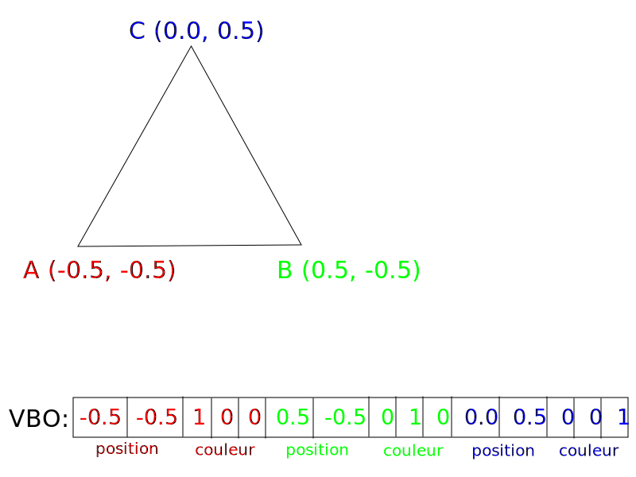
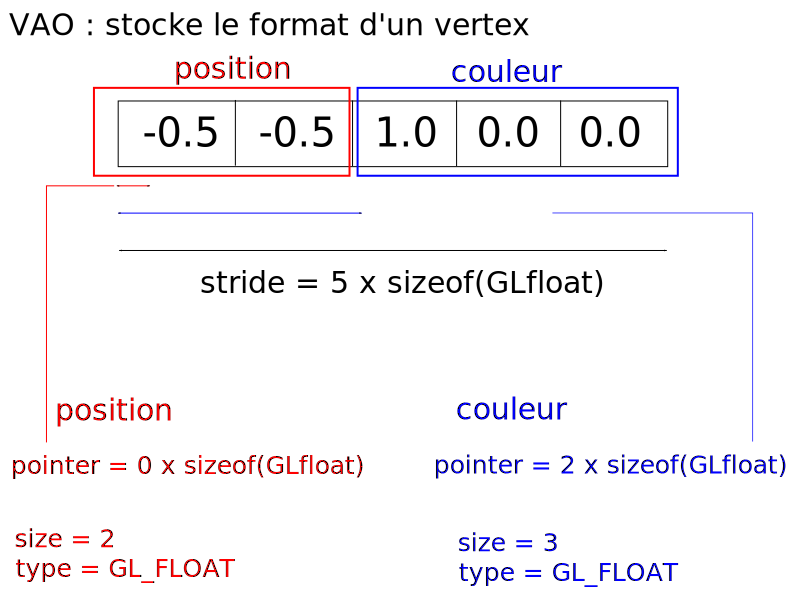

L'objectif à présent est de dessiner un triangle en couleur. Mais en OpenGL3, la couleur n'est pas gratuite : il faut utiliser des shaders. Nous verrons comment écrire et interagir avec des shaders lors du prochain TP. Pour ce TP je vais vous fournir des shaders déjà codés que vous chargerez en utilisant la classe fournie dans le template.

Copiez le code du `main` de `TP1_exo1_triangle_blanc` dans celui de `TP1_exo2_triangle_couleurs`. Faites l'exercice dans ce dernier.

Dans le code d'initialisation, rajoutez

```cpp
const p6::Shader shader = p6::load_shader(
    "shaders/triangle.vs.glsl",
    "shaders/triangle.fs.glsl"
);
```

Ce code a pour effet de charger les shaders et les compiler (à l'exécution de l'application). 
Puis dans le code de rendu, avant d'appeler `glDrawArrays()`, rajoutez

```cpp
shader.use();
```

qui indique à OpenGL d'utiliser ce shader.

Il faut maintenant modifier le code pour ajouter une couleur à chaque sommet. Faisons-le par étape.

## Modifier le tableau de sommets

Les couleurs sont gérées en OpenGL par des nombres flottants entre 0 et 1 (et non pas 0 et 255 comme dans la plupart des logiciels de dessin). Nous allons associer la couleur rouge $(1, 0, 0)$ au premier sommet, vert $(0, 1, 0)$ au deuxième sommet et bleu $(0, 0, 1)$ au troisième sommet.

Pour cela on modifie le tableau de sommets en rajoutant la couleur après chaque position :

```cpp
GLfloat vertices[] = { 
    -0.5f, -0.5f, 1.f, 0.f, 0.f, // Premier sommet
     0.5f, -0.5f, 0.f, 1.f, 0.f, // Deuxième sommet
     0.0f,  0.5f, 0.f, 0.f, 1.f  // Troisième sommet
 };
```

<div class="white-background">



</div>

Il faut également modifier l'appel à `glBufferData` afin de mettre à jour la taille du tableau qu'on lui envoie. Avant on lui passait `6 * sizeof(GLfloat)`, à présent c'est `15 * sizeof(GLfloat)` (15 = le nombre de floats du tableau).

## Activation et spécification des attributs de vertex

Puisqu'on rajoute l'attribut couleur, il faut le spécifier. Il faut également modifier la spécification de l'attribut position car toute l'organisation du tableau de vertex a changé.

### Connaître l'index associé aux attributs

Comme mentionné précédemment, chaque attribut est identifié par un index. Dans l'exercice précédent, on n'utilisait pas de shader, et la position était identifiée par l'index 0 (par défaut en OpenGL). À présent, on utilise des shaders. Pour connaître l'index associé à chaque attribut, ouvrez le fichier `triangle.vs.glsl` qui est dans le dossier `shaders` de `TP1_exo2_triangle_couleurs`. En début de fichier, vous devriez lire les lignes :

```glsl
layout(location = 3) in vec2 aVertexPosition;
layout(location = 8) in vec3 aVertexColor;
```

Ces deux lignes déclarent les attributs de vertex du shader. La partie `location = X` indique l'index associé à chaque attribut. Notez bien que c'est moi qui ai choisi les indices 3 et 8 dans ce cas. J'aurais très bien pu choisir d'autres nombres !

En utilisant les indices déclarés dans le fichier, modifiez votre code C++ de manière à activer les deux attributs de vertex position et couleur (Rappel : avec la fonction `glEnableVertexAttribArray`). Vous devez normalement avoir deux appels à cette fonction.

### Spécifier les attributs de vertex

Il faut à présent modifier l'appel à `glVertexAttribPointer` pour l'attribut position et en rajouter un pour l'attribut couleur.

Voici un rappel de la signature de la fonction et des paramètres :

```cpp
glVertexAttribPointer(GLuint index, 
    GLint size, GLenum type, GLboolean normalized, 
    GLsizei stride, const GLvoid* pointer)
```

Paramètres:

- `GLuint index` : l'index de l'attribut à spécifier.
- `GLint size` : le nombre de composantes de l'attribut.
- `GLenum type` : une constante OpenGL indiquant le type de chaque composante. Dans notre cas on passe `GL_FLOAT` pour indiquer que chaque composante est un nombre flottant.
- `GLboolean normalized` : pas besoin de s'occuper de ce paramètre pour le moment, on passe `GL_FALSE`.
- `GLsizei stride` : indique à OpenGL le nombre d'octets séparant l'attribut pour deux sommets consécutifs.
- `const GLvoid* pointer` : un pointeur, ou pas. Ce paramètre est un piège. Il faut en fait passer l'offset (décalage) en octets de la premiere instance de l'attribut dans le tableau.

Ce schéma vous indique les paramètres à passer pour chaque attribut et comment les trouver :

<div class="white-background">



</div>

Modifier votre premier appel à `glVertexAttribPointer` pour spécifier l'attribut position correctement. Ajouter juste après un deuxième appel afin de spécifier l'attribut couleur. À noter qu'il faut caster le dernier paramètre (l'offset) en `const GLvoid*` afin d'éviter une erreur de compilation.

## Tester le code

C'est terminé ! Eh oui c'était rapide par rapport à l'exercice précédent. Vous pouvez compiler et tester le code. Le résultat attendu est :

