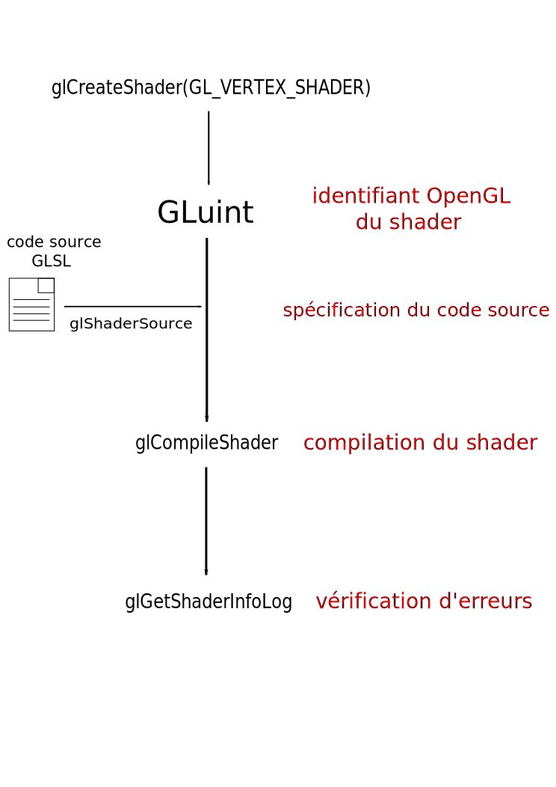

Pour utiliser un couple de shaders il faut fournir leur code source à OpenGL, puis lui demander de compiler les shaders pour produire un **programme GPU**. Ce programme peut ensuite être utilisé avant de dessiner. Il est possible de changer de programme à la volée pour dessiner des objets différents avec des shaders différents. Cette section vous présente rapidement les fonctions permettant de créer et compiler des shaders en OpenGL sans rentrer dans les détails. Les fonctions de la bibliothèque p6 fournie dans le template de code vous permettent de faire tout ça très rapidement.

## Création et compilation d'un shader

OpenGL fournit les fonctions suivantes:

- `glCreateShader` qui permet de créer un nouveau shader et renvoie son identifiant OpenGL ([glCreateShader](https://www.khronos.org/registry/OpenGL-Refpages/gl4/html/glCreateShader.xhtml)).
- `glShaderSource` qui permet de spécifier le code source du shader sous la forme de string ([glShaderSource](https://www.khronos.org/registry/OpenGL-Refpages/gl4/html/glShaderSource.xhtml)). Lorsque le shader est stocké dans un fichier il est nécessaire de le charger préalablement (ce que vous pourrez faire avec le code fourni).
- `glCompileShader` qui permet de compiler un shader ([glCompileShader](https://www.khronos.org/registry/OpenGL-Refpages/gl4/html/glCompileShader.xhtml)). Les shaders sont donc compilés au moment de l'exécution de votre programme, lors de l'initialisation le plus souvent.
- `glGetShaderInfoLog` qui nous permet d'obtenir des messages d'erreur / warning relatifs à la compilation d'un shader ([glGetShaderInfoLog](https://www.khronos.org/registry/OpenGL-Refpages/gl4/html/glGetShaderInfoLog.xhtml)).

Le pipeline de compilation d'un shader peut donc être représenté par ce schéma :

<div class="white-background">



</div>

## Création et link d'un programme

Une fois qu'un VS et un FS ont été compilés, il faut les lier en un programme. Pour cela OpenGL fournit les fonctions suivantes :

- `glCreateProgram` qui permet de créer un nouveau programme GLSL et renvoie son identifiant OpenGL ([glCreateProgram](https://www.khronos.org/registry/OpenGL-Refpages/gl4/html/glCreateProgram.xhtml)).
- `glAttachShader` qui permet d'attacher un shader à un programme ([glAttachShader](https://www.khronos.org/registry/OpenGL-Refpages/gl4/html/glAttachShader.xhtml)). Il faut attacher le VS et le FS au programme.
- `glLinkProgram` qui permet de linker les deux shaders et ainsi avoir un programme utilisable ([glLinkProgram](https://www.khronos.org/registry/OpenGL-Refpages/gl4/html/glLinkProgram.xhtml)).
- `glGetProgramInfoLog` qui nous permet d'obtenir des messages d'erreur / warning relatifs au link du programme. ([glGetProgramInfoLog](https://www.khronos.org/registry/OpenGL-Refpages/gl4/html/glGetProgramInfoLog.xhtml)).

<div class="white-background">


</div>

## Utiliser le code fourni

Le code que je vous ai fourni vous permet de charger, compiler et utiliser des shaders GLSL. Vous l'avez déjà utilisé au TP3 pour afficher le triangle en couleur.

Pour que le tout fonctionne bien, les shaders doivent être placés dans le répertoire `shader` correspondant à l'exo courant (donc TP4 actuellement). Le fichier CMake se charge de copier ce répertoire dans le build afin d'avoir un chemin de fichier relatif à l'exécutable. À chaque fois qu'un shader est ajouté ou changé, il est automatiquement copié dans le build.

La classe `p6::Shader` représente un programme GPU. La fonction `p6::load_shader()` charge et compile un vertex shader et un fragment shader pour produire un programme. Si une erreur de compilation est détectée, une exception est lancée par la fonction et arrête votre exécutable. L'erreur est affichée et vous pouvez la corriger.

Le code type pour charger des shaders est donc :

```cpp
const p6::Shader shader = p6::load_shader(
    "shaders/[VERTEX_SHADER]",
    "shaders/[FRAGMENT_SHADER]"
);
```

Il faut bien évidemment remplacer `[VERTEX_SHADER]` par le nom du fichier contenant le code source du VS et `[FRAGMENT_SHADER]` par le nom du fichier contenant le code source du FS.

Dans le TP4, copiez le code C++ permettant de dessiner un triangle en couleur (celui du TP3).

Dans le dossier shader du TP4, créez deux fichiers `color2D.vs.glsl` et `color2D.fs.glsl`. Dans ces deux fichiers, copiez-collez le code des shaders expliqués précédemment :

<div style={{display: 'flex'}}>

```glsl title="Vertex Shader"
#version 330 core

layout(location = 0) in vec2 aVertexPosition;
layout(location = 1) in vec3 aVertexColor;

out vec3 vFragColor;

void main() {
  vFragColor = aVertexColor;
  gl_Position = vec4(aVertexPosition, 0., 1.);
};
```

```glsl title="Fragment Shader"
#version 330 core

in vec3 vFragColor;

out vec3 fFragColor;

void main() {
  fFragColor = vFragColor;
};
```

</div>

Modifiez le code C++ copié afin qu'il fonctionne avec ces shaders. Il y a deux choses à changer :

- Le chargement des shaders : il faut changer le nom des fichiers.
- L'index des attributs : ce n'est plus 3 et 8 mais 0 et 1.

Le triangle en couleur devrait s'afficher correctement. Afin de voir comment se comporte le programme lorsqu'un shader contient une erreur, introduisez en une dans le Vertex Shader. Constatez l'erreur puis corrigez-la. (Une erreur simple à introduire : rajoutez "bhbfhzebfhbzefjze" juste avant la fonction main du shader).
