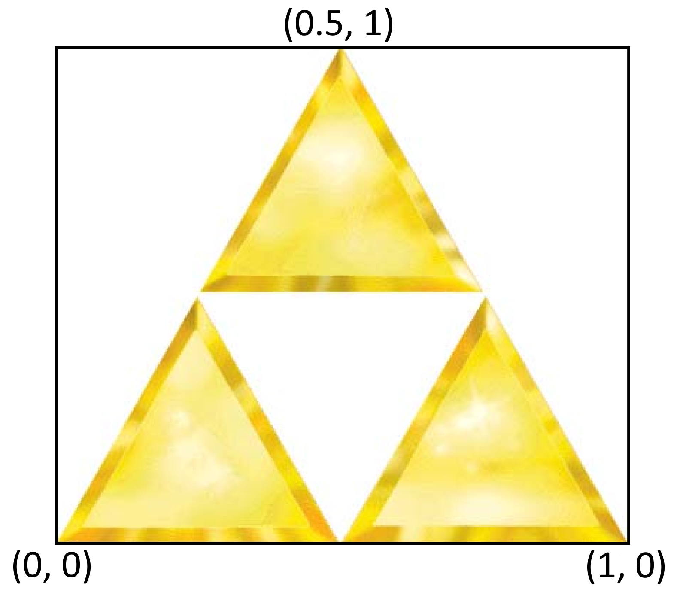

L'objectif est à présent d'appliquer une texture aux triangles. Téléchargez le fichier [triforce.png](https://igm.univ-mlv.fr/~biri/Enseignement/IMAC2/opengl-TPs/resources/triforce.png) et placez-le dans le répertoire `assets/textures`.

## Charger l'image

La fonction `p6::load_image_buffer()` vous permet de charger une image depuis le disque.

En utilisant cette fonction, chargez la texture de triforce (le chemin devrait être `"assets/textures/triforce.png"`). Si le chargement échoue, une exception sera levée. Le chargement de la texture doit être fait avant la boucle de rendu (par exemple juste avant le chargement des shaders).

## Créer un texture object OpenGL

Il faut ensuite envoyer la texture à la carte graphique. Pour cela OpenGL propose les texture objects.

En utilisant la fonction [glGenTextures](https://www.khronos.org/registry/OpenGL-Refpages/gl4/html/glGenTextures.xhtml), créez un nouveau texture object.

À l'aide de la fonction [glBindTexture](https://www.khronos.org/registry/OpenGL-Refpages/gl4/html/glBindTexture.xhtml), bindez la texture sur la cible `GL_TEXTURE_2D`.

Utilisez ensuite la fonction [glTexImage2D](https://www.khronos.org/registry/OpenGL-Refpages/gl4/html/glTexImage2D.xhtml) pour envoyer l'image à la carte graphique afin qu'elle soit stockée dans votre texture object. Pour cela il faut utiliser les méthodes suivantes de la classe image : `width()` pour obtenir la largeur, `height()` pour obtenir la hauteur et `data()` pour obtenir le tableau de pixels. La fonction `glTexImage2D` prend également en paramètre des formats (`internalFormat` et `format`), passez-lui pour ces deux paramètres la constante `GL_RGBA`. Le paramètre `type` doit être `GL_UNSIGNED_BYTE` car la classe `img::Image` stocke ses pixels en `uint8_t`. Enfin les paramètres `level` et `border` doivent être mis à 0.

Afin de pouvoir utiliser une texture, il faut spécifier à OpenGL des filtres que ce dernier appliquera lorsque 1) plusieurs pixels à l'écran sont couverts par un pixel de texture et 2) un pixel à l'écran couvre plusieurs pixels de texture. Rajoutez les lignes suivantes :

```cpp
glTexParameteri(GL_TEXTURE_2D, GL_TEXTURE_MIN_FILTER, GL_LINEAR);
glTexParameteri(GL_TEXTURE_2D, GL_TEXTURE_MAG_FILTER, GL_LINEAR);
```

Ces deux lignes permettent d'appliquer un filtre linéaire dans les deux cas cités plus haut. Référez-vous à la documentation si vous êtes interessé.e.s par d'autres filtres.

Débindez la texture en utilisant [glBindTexture](https://www.khronos.org/registry/OpenGL-Refpages/gl4/html/glBindTexture.xhtml) avec 0 passé en deuxième paramètre.

À la fin du programme, ajoutez un appel à [glDeleteTextures](https://www.khronos.org/registry/OpenGL-Refpages/gl4/html/glDeleteTextures.xhtml) afin de détruire le texture object.

## Spécifier les coordonnées de texture

Jusqu'à présent nous avions mis les coordonnées de texture des vertex à $(0, 0)$. Il faut les changer afin que chaque vertex soit associé au bon pixel dans la texture. Voici un schéma indiquant les coordonnées de texture à associer à chaque vertex :

<div class="white-background" style={{'width': '50%'}}>



</div>

Le coin bas-gauche a pour coordonnées $(0, 0)$ et le coin haut-droit $(1, 1)$ (quelles que soient les dimensions de l'image d'entrée).

Dans le tableau de sommets, modifiez les coordonnées de texture de chacun des sommets à partir du schéma ci-dessus.

## Utiliser la texture dans le shader

Une texture s'utilise dans un fragment shader en utilisant une variable uniforme de type `sampler2D`.

Ajoutez une variable uniforme nommée `uTexture` dans votre fragment shader.

Il est ensuite possible de lire dans la texture en utilisant la fonction GLSL `texture(sampler, texCoords)`. Le premier paramètre est le `sampler2D` (`uTexture` dans notre shader) et le deuxième paramètre les coordonnées de texture du fragment. Ces dernières doivent être récupérées en entrée du fragment shader depuis le vertex shader (comme nous faisions au TP précédent pour la couleur et la position).

Faites en sorte que la couleur affichée par le fragment shader soit celle lue depuis la texture à la bonne position. Attention : la fonction texture renvoie un `vec4`, il faut donc le transformer en `vec3` si votre variable de sortie du fragment shader est de type `vec3`.

## Spécifier la valeur de la variable uniforme

Dans le code de l'application, récupérez la location de la variable uniforme en utilisant `glGetUniformLocation`.

Les samplers GLSL sont en réalité des entiers. Il faut les remplir à l'indice de l'unité de texture sur laquelle est branchée la texture voulue. Nous verrons plus tard les unités de texture, pour l'instant nous en utilisons une sans nous en rendre compte : l'unité de texture 0. Il faut donc remplir la variable uniforme avec la valeur 0 en utilisant la fonction `glUniform1i`.

Dans la boucle de rendu, avant l'appel à `glDrawArrays` : bindez la texture sur la cible `GL_TEXTURE_2D`, puis fixez la valeur de la variable uniforme `uTexture` à 0. Après l'appel à `glDrawArrays`, débindez la texture. Testez votre programme : les triangles doivent à présent être texturés. 