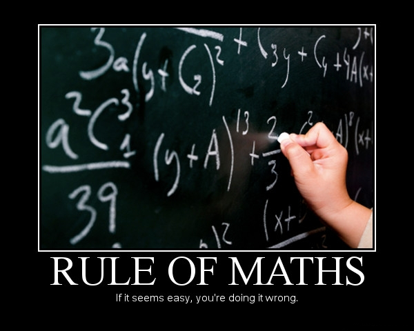
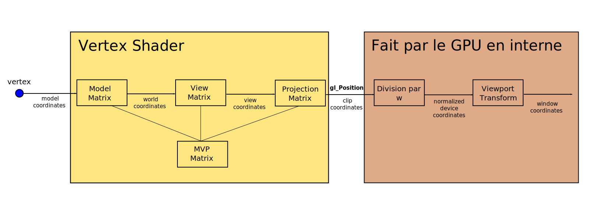
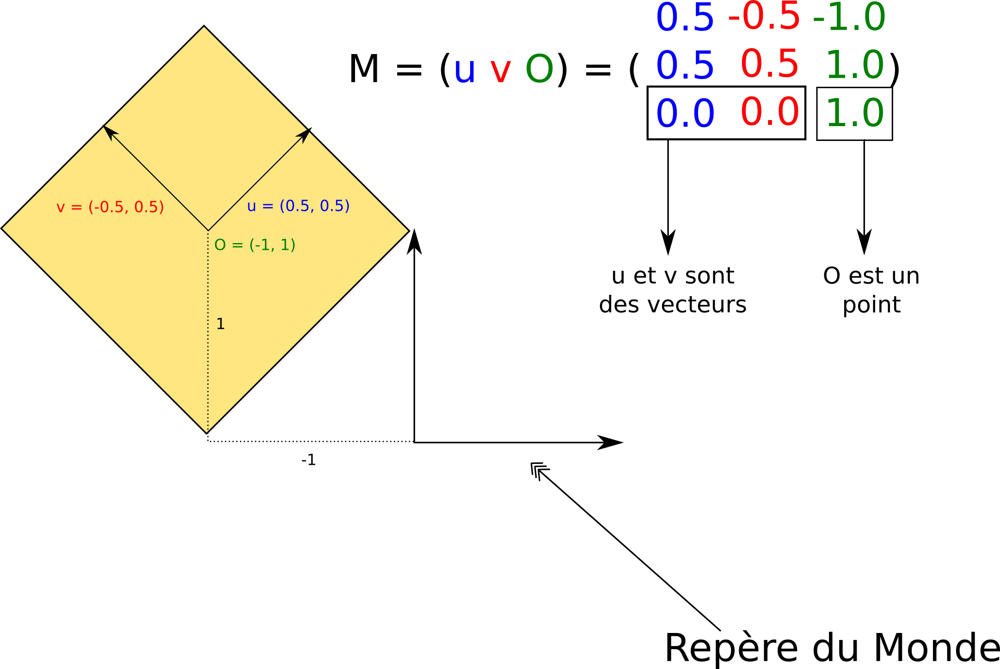

import ToDo from "@site/src/components/ToDo"

## TP5 : "Dessiner" en 3D - la théorie

 Pour "dessiner" des objets en 3D sur une surface 2D (votre écran), il est nécessaire d'appliquer une projection. En réalité OpenGL a très peu de connaissances sur votre 3D : l'algorithme de rasterization est appliqué sur les coordonnées projetées avec l'ajout de la profondeur simplement pour décider si un fragment vient masquer un fragment déjà présent dans le framebuffer. Nous allons donc commencer par une partie un peu théorique pour détailler chaque espace de coordonnées.

## Coordonnées homogènes

Bien que l'on travaille en 3D, on utilisera le plus souvent des vecteurs 4D pour représenter nos points / vecteurs et des matrices 4x4 pour représenter nos transformations.

Si l'on ne fait pas ça, on ne peut pas 1) représenter la translation avec une matrice et 2) représenter la projection avec une matrice. Or il est intéressant de pouvoir faire cela afin de combiner toutes les transformations simplement en multipliant les matrices.

Notre application enverra des vecteurs 3D au GPU et dans les shaders nous les transformerons en vecteurs 4D en respectant la règle suivante : si l'entité est un point (une position) on ajoute 1 comme quatrième coordonnée, si c'est un vecteur (une normale par exemple) on ajoute 0 comme quatrième coordonnée.

Position $(x, y, z)$->$(x, y, z, 1)$ 
Vecteur  $(x, y, z)$->$(x, y, z, 0)$

De cette manière une position est correctement translatée par une matrice de translation et un vecteur ne bouge pas (ce qui est cohérent car un vecteur n'a pas de position).

Soit la matrice de translation 4x4

$$T_{t_x, t_y, t_z} = \begin{pmatrix}
1 & 0 & 0 & t_x \\
0 & 1 & 0 & t_y \\
0 & 0 & 1 & t_z \\
0 & 0 & 0 & 1
\end{pmatrix}$$

Vérifiez sur papier qu'en multipliant $T_{t_x, t_y, t_z}$ par $P_1=(x, y, z, 1)$ on obtient bien $P_2=(x+t_x, y+t_y, z+t_z, 1)$ et qu'en multipliant $T_{t_x, t_y, t_z}$ par $V_1 = (x, y, z, 0)$ on obtient bien $V_2 = (x, y, z, 0)$. Attention à l'ordre de multiplication : $P_2 = T_{t_x, t_y, t_z}P_1$ (toujours l'entité à transformer à droite).

## Vue globale des transformations

Ce schéma donne une vision globale de la suite de transformations appliquées sur un vertex. La partie en jaune doit être implantée dans votre vertex shader. Il est très facile de transformer le sommet d'entrée : il suffit d'appliquer une ou plusieurs multiplication.s matricielle.s pour calculer la variable de sortie `gl_Position`.

## Model Coordinates

Les Model Coordinates (MC) sont les coordonnées des sommets dans l'espace local à l'objet courant. Ce sont celles qui sont fournies par l'application en les stockant dans des VBOs. Par exemple dans les TPs précédents les MC de notre triangle étaient : $P_1=(-1,-1)$, $P_2=(1,-1)$ et $P_3=(0, 1)$.

Les fichiers générés par les logiciels de modélisation 3D contiennent les MC des objets.

## World Coordinates

Les World Coordinates (WC) sont les coordonnées des sommets dans l'espace du monde. Chaque objet possède une Model Matrix $M$ permettant d'obtenir les WC de ses sommets à partir des MC. Si on note $P_m$ les MC d'un sommet et $P_w$ ses WC, on a la relation suivante:

$$P_w = M \times P_m$$

Chaque colonne de la Model Matrix d'un objet est un vecteur du repère de ce dernier exprimé dans le repère monde. La 4ème colonne est l'origine du repère. Voici un schéma (coordonnées en 2D pour la lisibilité) pour mieux comprendre :

## View Coordinates

Les View Coordinates (VC) sont les coordonnées des sommets dans l'espace de la caméra. On les obtient en multipliant les WC par la View Matrix $V$ :

$$P_v = V \times P_w = V \times M \times P_m$$

La matrice $MV = V \times M$ est appelée la ModelView Matrix. Attention : on la nomme dans l'ordre inverse de la multiplication.

Les colonnes de la matrice View sont les vecteurs du repère du monde exprimés dans le repère de la caméra (la 4eme colonne est l'origine du monde exprimée dans le repère de la caméra). On peut voir la View Matrix comme une Model Matrix pour le monde complet (vu comme un unique objet).

## Clip Coordinates

Les Clip Coordinates (CC) sont les coordonnées qu'il faut placer dans la variable `gl_Position` du fragment shader. Le GPU prend ensuite le relai. On les obtient en multipliant les VC par la Projection Matrix $P$ :

$$P_{clip} = P \times P_v = P \times V \times M \times P_m$$

La matrice $MVP = P \times V \times M$ est appelée la ModelViewProjection Matrix.

## Les Normalized Device Coordinates (NDC)

Les NDC sont calculées par le GPU en divisant les CC par la quatrième composante. Soit $P_{clip} = (x_{clip},y_{clip},z_{clip}, w_{clip})$ un point exprimé en Clip Coordinates. Alors on a :

$$P_{ndc} = (x_{ndc},y_{ndc},z_{ndc}) = (x_{clip} / w_{clip},y_{clip} / w_{clip},z_{clip} / w_{clip})$$

On remarque qu'à partir de ce point, le GPU ne travaille plus en coordonnées homogènes.

On a de plus une propriété intéressante : sur chacun des axes les NDC sont comprises entre -1 et 1 pour les points visibles depuis la caméra. Si un fragment a ses NDC non comprises entre -1 et 1 alors le GPU ne le traitera pas.

## Window Coordinates

Les Window Coordinates (WC) sont les coordonnées de fragments exprimées en pixels. OpenGL utilise les données passées en utilisant la fonction `glViewport(X, Y, W, H)` (qui définit la zone de la fenêtre dans laquelle dessiner) et la fonction `glDepthRange(N, F)` (qui définit la range de profondeur) pour obtenir les WC à partir des NDC :

$$(x_{wc},y_{wc},z_{wc}) = (\frac{W}{2}x_{ndc} + X + \frac{W}{2}, \frac{H}{2}y_{ndc} + Y + \frac{H}{2}, \frac{F-N}{2}z_{ndc} + \frac{F+N}{2})$$

$(x_{wc},y_{wc})$ définit les coordonnées du pixel qui recevra la couleur du fragment et $Z_{wc}$ est la profondeur qui sera écrite dans le Depth Buffer si le Depth Test est activé. 