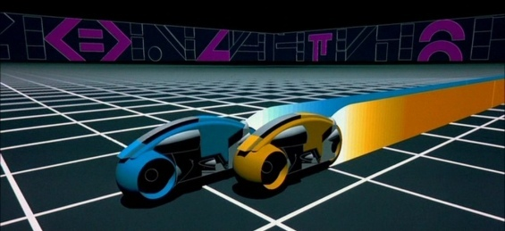

import ToDo from "@site/src/components/ToDo"

## TP6 : "Dessiner" en 3D - la pratique

Nous allons dans un premier temps dessiner des objets en 3D sans nous occuper de la caméra. Cela revient à utiliser comme **ViewMatrix** la matrice identité. L'objectif de ce TP sera donc de calculer des **ModelMatrix** de manière à dessiner nos objets en 3D à la bonne position.

Pour cela rien de mieux que de dessiner une planète et ses satellites ! En effet, les satellites tournant autour de la planète, il faut gérer la relation de hiérarchie en combinant correctement les transformations. 