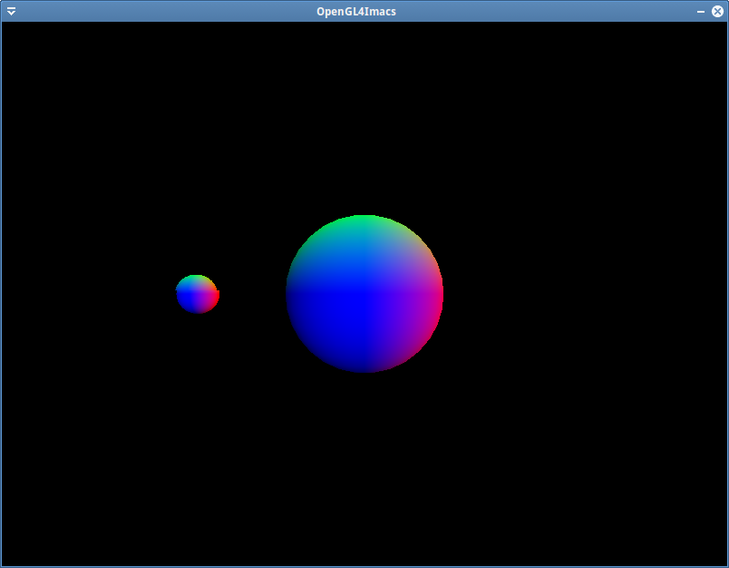
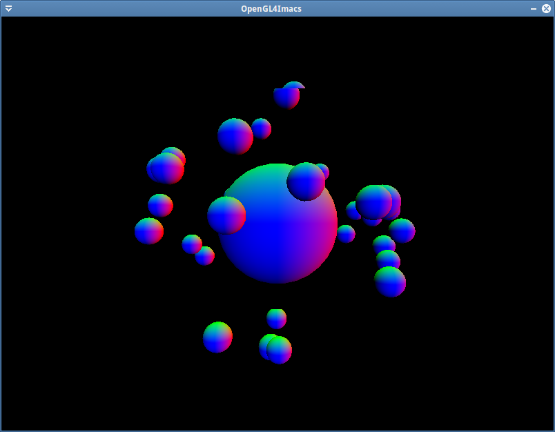

L'objectif à présent est de dessiner une lune tournant autour de notre sphère.

Dans notre cas une lune n'est rien de plus qu'une deuxième sphère, plus petite, placée relativement par rapport à la première.

Il va donc falloir dessiner deux sphères en changeant les transformations courantes avant chaque dessin. En particulier la matrice de transformation de la lune doit être en partie constituée de la transformation associée à la planète (puisque la lune tourne autour de la planète).

Pour dessiner une deuxième sphère, il ne faut surtout pas créer un deuxième couple VBO/VAO contenant les sommets d'une sphère plus petite. À la place on appelle juste deux fois la fonction `glDrawArrays` en modifiant les transformations avant chaque appel (on aura en particuler une transformation de type scale pour réduire la taille de la sphère).

Il est possible de combiner les transformations avec GLM en utilisant le premier paramètre de chaque fonction de transformation. Voici un exemple de code commenté :

```cpp
glm::mat4 MVMatrix = glm::translate(glm::mat4{1.f}, {0.f, 0.f, -5.f}); // Translation
MVMatrix = glm::rotate(MVMatrix, ctx.time(), {0.f, 1.f, 0.f}); // Translation * Rotation
MVMatrix = glm::translate(MVMatrix, {-2.f, 0.f, 0.f}); // Translation * Rotation * Translation
MVMatrix = glm::scale(MVMatrix, glm::vec3{0.2f}); // Translation * Rotation * Translation * Scale
```

La matrice passée en paramètre est multiplié à droite par la transformation demandée puis le résultat est renvoyé. Cela permet de recréer un concept de pile de transformation.

En utilisant des combinaisons de transformations, dessinez une lune. Dans un premier temps dessinez-la immobile à gauche de la première sphère. Ensuite faites-la tourner autour en utilisant comme angle de rotation le temps renvoyé par la méthode `time()` du `p6::Context`.



De la même manière, en utilisant une boucle, dessinez 32 lunes tournant autour de la planète, placées pseudo-aléatoirement. Pour cela il suffit de tirer l'axe de rotation aléatoirement. Avant la boucle rendu, utilisez la fonction `glm::sphericalRand` ([doc](http://glm.g-truc.net/0.9.4/api/a00154.html)) pour tirer 32 axes de rotation que vous placerez dans un `std::vector` de `glm::vec3`. Utilisez ensuite ce vector dans la boucle de rendu pour dessiner toutes vos lunes. (Il faut inclure le header `glm/gtc/random.hpp` pour utiliser `glm::sphericalRand`). Testez le programme : il y a normalement un problème. Identifiez sa cause et corrigez-le pour avoir un résultat à peu près cohérent.

