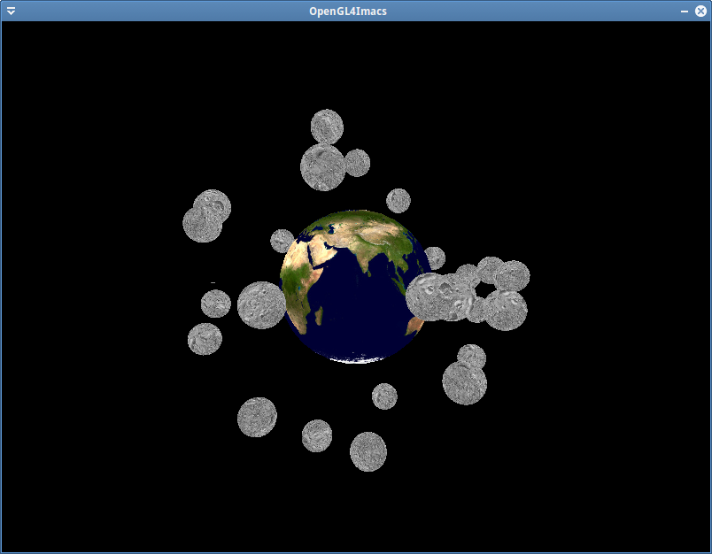

Nous allons utiliser des textures pour donner à la planète l'apparence de la Terre. La fonction `glimac::sphere_vertices` calcule automatiquement des coordonnées de texture qui sont reçues par le shader. Il suffit donc de charger et binder correctement une texture de Terre puis d'y accéder correctement depuis le fragment shader pour avoir une apparence correcte.

Téléchargez les texture [EarthMap.jpg](https://igm.univ-mlv.fr/~biri/Enseignement/IMAC2/opengl-TPs/resources/EarthMap.jpg) et [MoonMap.jpg](https://igm.univ-mlv.fr/~biri/Enseignement/IMAC2/opengl-TPs/resources/MoonMap.jpg) et placez-les dans le répertoire `assets/textures`.

Créez un nouveau shader `tex3D.fs.glsl`. Dans celui-ci, créez une variable uniforme de type `sampler2D` et utilisez les coordonnées de texture en entrée pour obtenir la couleur de sortie en lisant dans la texture. Au besoin relisez le TP sur les textures pour vous aider.

Dans le code de l'application chargez la texture EartMap.jpg. Créez un texture object OpenGL à partir de l'image et bindez-la correctement pour qu'elle soit affichée lors du rendu. Testez le programme. Faites ensuite en sorte que la Terre tourne sur elle même, mais pas les lunes !

Un problème apparaît normalement : vos lunes ont également l'apparence de la Terre. Afin de modifier cela, il suffit de modifier la texture bindée avant de dessiner les lunes. Chargez la texture MoonMap.jpg, créez un texture object OpenGL associé et utilisez ce dernier pour dessiner les lunes.

