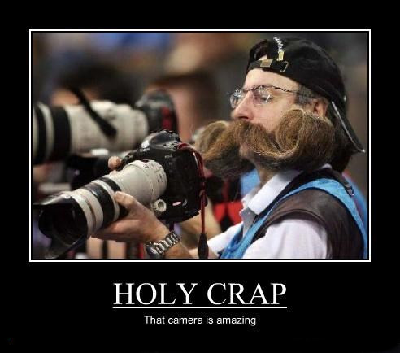

import ToDo from "@site/src/components/ToDo"

## TP7 : Gestion de la caméra

Maintenant que nous avons vu comment dessiner une scène en 3D, il faut se déplacer dans cette scène. Faire de la gestion de caméra revient simplement à calculer une **ViewMatrix** en fonction des entrées utilisateur. Nous allons voir deux modèles simples de caméra durant ce TP : la Trackball camera permet de tourner autour d'un point central et la Freefly camera permet de se déplacer librement.

D'une certaine manière, déplacer la caméra selon une certaine transformation revient à déplacer la scène selon la transformation inverse : si j'avance, c'est comme si le monde reculait. Tout est question de référentiel.