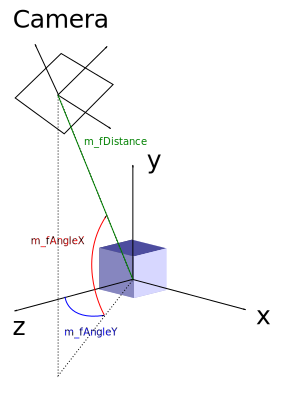

La caméra TrackBall est très simple : elle ne peut que tourner autour du centre de la scène (ou d'un objet) et s'en rapprocher ou s'en éloigner. C'est le type de caméra souvent utilisé pour visualiser des planètes. Elle est également utilisée dans les jeux à la troisième personne : elle reste centrée sur le personnage principal autour duquel on peut tourner.

Nous utiliserons la molette de la souris pour nous rapprocher ou nous éloigner du centre de la scène. La rotation sera gérée par les mouvements verticaux et horizontaux de la souris lorsque le bouton droit est pressé.

Créez un nouveau fichier `TrackballCamera.hpp` dans `src-common`.

Dans ce fichier créez la classe `TrackballCamera`. Celle-ci doit contenir trois variables membres privées : `float m_Distance`, `float m_AngleX` et `float m_AngleY`. Ces 3 variables représentent respectivement : la distance par rapport au centre de la scène, l'angle effectué par la caméra autour de l'axe X de la scène (rotation vers le haut ou vers le bas) et l'angle effectué par la caméra autour de l'axe Y de la scène (rotation vers la gauche ou vers la droite). Implantez ensuite le constructeur en initialisant les angles à 0 et la distance à 5.

Implantez ensuite les méthodes suivantes :

- `void moveFront(float delta)` permettant d'avancer / reculer la caméra. Lorsque `delta` est positif la caméra doit avancer, sinon elle doit reculer.
- `void rotateLeft(float degrees)` permettant de tourner latéralement autour du centre de vision.
- `void rotateUp(float degrees)` permettant de tourner verticalement autour du centre de vision.

Ces 3 méthodes doivent simplement additionner le paramètre reçu à la bonne variable membre.

Il faut ensuite coder la méthode `glm::mat4 getViewMatrix() const` qui calcule la ViewMatrix de la caméra en fonction de ses variables membres. Comme je l'ai dit dans l'introduction, déplacer la caméra c'est comme déplacer la scène à l'envers. Vous pouvez donc construire la ViewMatrix à partir d'une multiplication de 3 matrices : une translation faisant reculer la scène (on place ainsi la caméra à la bonne distance), une rotation autour de l'axe X puis une rotation autour de l'axe Y. Attention : il faut convertir les angles en radians.

Modifiez ensuite le code de l'exercice précédent pour pouvoir tourner autour de la planète en utilisant votre souris. Pour cela vous devez créer une `TrackballCamera` et appeler ses méthodes en fonction des évènements souris et clavier ([lisez la doc](https://julesfouchy.github.io/p6-docs/tutorials/events) pour savoir comment intercepter ces différents évènements).

Puisque la caméra est susceptible de changer à chaque tour de boucle, vous devez au début de chaque tour récupérer la ViewMatrix en utilisant la méthode `getViewMatrix()` puis la combiner aux matrices Projection et Model pour construire correctement les 3 matrices (MVMatrix, NormalMatrix et MVPMatrix) avant de les envoyer au shader.