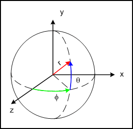

Ce type de caméra est utilisé dans les jeux à la première personne (les jeux où on voit à travers les yeux de l'héros·ïne, comme les FPS). Elle permet de se déplacer dans toutes les directions et de tourner sur soi-même (la caméra TrackBall ne permettant que de tourner autour du centre de la scène).

Sa ViewMatrix peut être calculée par un simple appel à la fonction `glm::lookAt(eye, point, up)`. Le premier argument est simplement la position de la caméra exprimée dans le monde. Le deuxième argument est un point que la caméra regarde. Le dernier argument est l'axe vertical de la caméra.

Les arguments `point` et `up` doivent être calculés en passant par les coordonnées sphériques, illustrées ci-dessous.

Les coordonnées sphériques $(\phi, \theta)$ sont les angles qui définissent le vecteur $\vec{F}$ (qu'on appelera le "front vector") pointant en face de la caméra. On veut pouvoir contrôler ces angles en utilisant la souris. Notre objectif est de calculer les arguments `point` et `up` simplement à partir de la position de la caméra (argument `eye`) et des angles $(\phi, \theta)$. Ces trois données seront stockées dans notre classe.

Le point de vue $V$ (argument `point`) s'obtient simplement en additionnant le vecteur $\vec{F}$ à la position : $V = P + \vec{F}$.

Il faut donc pouvoir calculer les coordonnées du vecteur $\vec{F}$ en fonction de ses coordonnées sphériques $(\phi, \theta)$ :

$$\vec{F} = (\cos(\theta)\sin(\phi), \sin(\theta), \cos(\theta)\cos(\phi))$$

(attention ici les angles sont exprimés en radians).

Il ne reste que le vecteur vertical $\vec{U}$ (pour "up") à calculer. Pour cela nous allons utiliser le vecteur $\vec{L}$ (pour "left") pointant à gauche car il nous resservira par la suite pour faire bouger la caméra latéralement. On a la relation suivante pour $\vec{L}$ :

$$\vec{L} = (\sin(\phi + \frac{\pi}{2}), 0, \cos(\phi + \frac{\pi}{2}))$$

Et pour $\vec{U}$ :

$$\vec{U} = \vec{F} \times \vec{L}$$

où $\times$ est le produit vectoriel entre les deux vecteurs (calculable avec la fonction `glm::cross(F, L)`).

C'est tout pour la théorie, passons à la pratique :

Créez la classe `FreeflyCamera` dans un nouveau fichier `FreeflyCamera.hpp`. Elle doit contenir les variables membre `glm::vec3 m_Position` représentant la position de la caméra, `float m_Phi` et `float m_Theta` représentant les coordonnées sphériques du vecteur $\vec{F}$. Ajoutez également les variables `glm::vec3 m_FrontVector`, `glm::vec3 m_LeftVector` et `glm::vec3 m_UpVector` qui contiendront les vecteurs $\vec{F}$, $\vec{L}$ et $\vec{U}$.

(Ces variables sont redondantes puisqu'elles peuvent être calculées à partir des coordonnées sphériques, mais elles nous permettront de faire moins de calculs à chaque tour de boucle).

Écrivez la méthode privée `computeDirectionVectors()` qui calcule les vecteurs `m_FrontVector`, `m_LeftVector` et `m_UpVector` à partir des coordonnées sphériques `m_Phi` et `m_Theta`. Pour cela il suffit d'appliquer les formules données plus haut.

Écrivez le constructeur. La position de la caméra doit être initialisée à $(0, 0, 0)$. `m_Phi` doit être initialisé à $\pi$ (de cette manière le vecteur $\vec{F}$ vaudra $(0, 0, -1)$ et on regarde ainsi vers l'axe négatif des Z, convention en OpenGL). `v` doit être initialisé à $0$. Dans le corps du constructeur, appelez votre méthode `computeDirectionVectors` afin que les vecteurs directionnels soient correctement initialisés également.

Écrivez les méthodes `moveLeft(float t)` et `moveFront(float t)`. Ces méthodes doivent déplacer la position de la caméra respectivement le long des vecteurs $\vec{L}$ et $\vec{F}$. (Déplacer un point $P$ le long d'un vecteur $\vec{V}$ correspond à faire `P += t * V`).

Écrivez les méthodes `rotateLeft(float degrees)` et `rotateUp(float degrees)` modifiant les angles de rotation `m_Phi` et `m_Theta` (attention à convertir degrees en radians avant de faire l'addition avec les angles courants).

Écrivez la méthode `glm::mat4 getViewMatrix() const` qui calcule et renvoie la matrice View associée à la caméra. Comme je l'ai dit plus haut, il suffit d'appeler `glm::lookAt` avec les bons arguments.

Reprenez le code précédent en utilisant cette fois la caméra FreeFly. Comme pour la caméra TrackBall, la caméra doit tourner lorsque la souris bouge alors que le bouton droit est pressé. Le déplacement doit être géré avec les touches Z, Q, S, D (comme dans un vrai FPS). La touche Z permet de bouger en avant, S en arrière, Q à gauche et D à droite. 