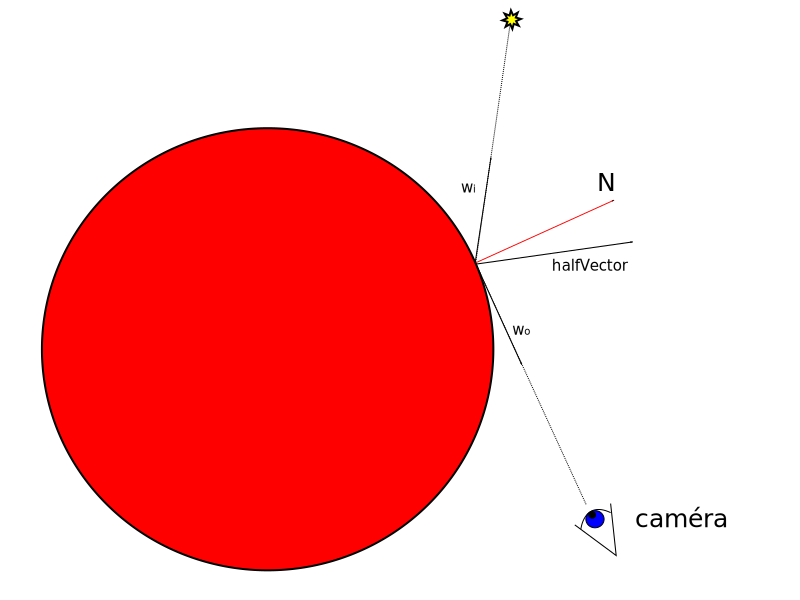

import ToDo from "@site/src/components/ToDo"

## TP8 : Put the lights on !

Ce dernier TP sera l'occasion d'implanter un modèle d'éclairage simple permettant de gérer des lumières de type ponctuelles ou directionelles, sans ombres.

Le modèle que nous allons mettre en place est le [modèle de Blinn-Phong](https://en.wikipedia.org/wiki/Blinn%E2%80%93Phong_shading_model). C'est le **fragment shader** qui se chargera de faire le calcul d'éclairage.

Le modèle de Blinn-Phong est défini par l'équation suivante :

$$Couleur = L_i(K_d(\vec{w_i}\cdot \vec{N})+K_s(\vec{halfVector}\cdot \vec{N})^{shininess})$$

où:

- $\vec{w_i}$ est la direction incidente depuis laquelle provient la lumière. On la calcule par rapport à la position de cette dernière.
- $L_i$ est la lumière (une couleur) incidente dans la direction $\vec{w_i}$. On la calcule par rapport à l'intensité et la distance à la source de lumière.
- $\vec{N}$ est la normale.
- $K_d$ est le coefficient de réflexion diffuse de l'objet. C'est une couleur qui dépend du matériau de l'objet.
- $K_s$ est le coefficient de réflexion glossy de l'objet. C'est une couleur qui dépend du matériau de l'objet.
- $shininess$ est un exposant de brillance permettant de contrôler la taille de la "tache" de brillance glossy. C'est un float qui dépend du matériau de l'objet.
- $\vec{halfVector}$ est le vecteur $\frac{\vec{w_o} + \vec{w_i}}{2}$, $\vec{w_o}$ étant le vecteur pointant vers la caméra.

Dans la formule, tous les produits "$\cdot$" entre vecteurs sont des produits scalaires. Les vecteurs doivent tous être normalisés.

La notion de **matériau** est très importante en synthèse d'image. Nous allons utiliser des variables uniformes pour passer les coefficients $K_d$, $K_s$ et $shininess$ au shader avant de dessiner. Cela aura pour effet de dessiner des objets dont le matériau est le même en chaque point. Dans une application plus complexe on utiliserait le **multi-texturing** pour binder une texture diffuse, une texture glossy et une texture de brillance. De cette manière on peut avoir des coefficients différents pour chaque point d'un objet.