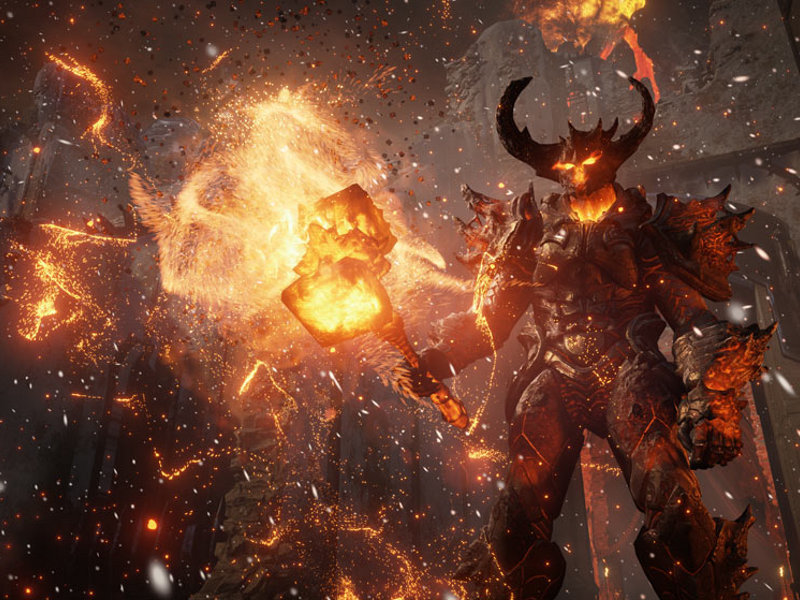
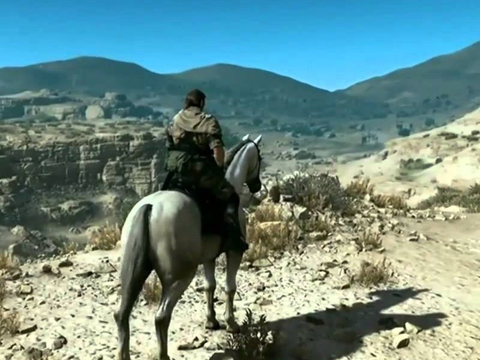

import tp1_image from './TP1/img/intro.jpg'
import tp2_image from './TP2/img/intro.png'
import tp3_image from './TP3/img/intro.png'
import tp4_image from './TP4/img/intro.jpg'
import tp5_image from './TP5/img/intro.jpg'
import tp6_image from './TP6/img/intro.jpg'
import tp7_image from './TP7/img/intro.jpg'
import tp8_image from './TP8/img/intro.jpg'
import TPLink from "@site/src/components/TPLink"

### OpenGL3+ | Embrace the 3D wizardry

Bienvenue dans le merveilleux monde de la 3D. Ici vous apprendrez que parfois les maths ça sert et même qu'on peut faire de jolies choses avec.

Malheureusement pour cela il faudra affronter un ennemi puissant. Vous l'avez sans doute déjà rencontré dans sa version 2. Cette raclure est de retour, plus fort que jamais.

Mais n'ayez crainte, votre serviteur est là pour vous apprendre à dresser la bête. À la fin de votre entraînement vous combattrez en équipe OpenGL 3 et libérerez ainsi la beauté de la 3D.

### Niveau Bronze

    <TPLink link="TP1/intro" img={tp1_image} text="TP1 : La philosophie OpenGL 3+"/>
    <TPLink link="TP2/telecharger-le-template" img={tp2_image} text="TP2 : Le template de code"/>
    <TPLink link="TP3/le-code-de-base" img={tp3_image} text="TP3 : Hello Triangle !"/>
    <TPLink link="TP4/shaders-kesako" img={tp4_image} text="TP4 : Dive into the GPU - les shaders"/>

### Niveau Argent

    <TPLink link="TP5/intro" img={tp5_image} text='TP5 : "Dessiner" en 3D - la théorie'/>
    <TPLink link="TP6/intro" img={tp6_image} text='TP6 : "Dessiner" en 3D - la pratique'/>
    <TPLink link="TP7/intro" img={tp7_image} text='TP7 : Gestion de la caméra'/>
    <TPLink link="TP8/intro" img={tp8_image} text="TP8 : Put the lights on !"/>

