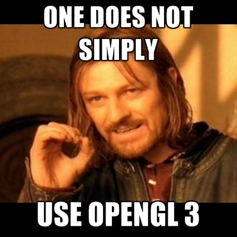

Ces TPs sont là pour vous apprendre la "nouvelle" version d'OpenGL, baptisée souvent OpenGL 3 (par opposition aux vieilles versions OpenGL 2). OpenGL 3 est souvent jugé plus compliqué qu'OpenGL 2. En réalité ce qui est plus compliqué c'est surtout de s'y mettre 😛 En effet, la quantité de code necessaire pour obtenir un simple triangle coloré est impressionante, ce qui a de quoi décourager. Néammoins une fois ce code mis en place il reste généralement tout le temps identique ou presque, d'où l'intéret de vous créer une base de code que vous allez pouvoir réutiliser entre les différents TPs.

## Qu'est ce que OpenGL ?

OpenGL est une **API** (Application Programming Interface) destinée au **rendu** par **rasterisation**. Ça fait beaucoup de mots compliqués, on va donc détailler un peu tout ça !

## Cartes graphiques et pilotes

Une API est simplement la spécification d'une liste de types, de fonctions et de constantes ainsi qu'une description de l'effet attendu pour chaque fonction. Cela signifie qu'OpenGL n'est pas une **implémentation**. N'importe qui peut décider de coder l'ensemble de l'API OpenGL. En particulier les constructeurs de **carte graphique** le font généralement et proposent un **driver**. Le driver (*pilote* en français) est un composant logiciel permettant de piloter (comme son nom l'indique) le matériel du constructeur, c'est-à-dire la carte graphique. Ce driver sert également de bibliothèque pour les développeur⸱euse.s que nous sommes. La carte graphique (également appelée **GPU** pour Graphical Processing Unit) permet d'accélerer les calculs de rendu en fournissant du matériel dedié. Il est néammoins possible d'utiliser une implémentation logicielle (c'est à dire qui s'éxecute sur **CPU**) de OpenGL comme par exemple MesaGL.

## Rasterisation

La rasterisation est une méthode de rendu consistant à transformer les primitives 3D (triangles, lignes et points) en pixels (appelés fragments). **OpenGL n'est pas une bibliothèque 3D**. Ou en tout cas ne l'est plus, depuis OpenGL 3. Comme vous le verrez OpenGL 3 n'a que peu de connaissances relatives à la notion de 3D. C'est à vous, grâce au **pipeline programmable**, de coder tout ce qui concerne la 3D. C'est ce qui fait la grande force d'OpenGL: l'ensemble est très modulaire et peut être utilisé pour faire de la 2D, de la 3D ou même encore des tâches qui n'ont rien à voir avec le rendu mais qui demandent une grande puissance de calcul parallèle.

## Le calcul parallèle sur GPU

En effet, l'avantage d'utiliser le GPU est d'avoir accès à un processeur spécialement dedié au **calcul parallèle**. Un GPU est constitué de milliers de cœurs pouvant éxecuter le même code au même moment. Chaque cœur n'est pas très puissant (moins qu'un cœur CPU en tout cas), mais c'est leur nombre qui fait leur force. Ainsi, faire plein de petites tâches en parallèle sur des cœurs moins puissant permet généralement d'aller plus vite qu'en les éxecutant séquentiellement sur un processeur très puissant.

## La concurrence

Il existe d'autres APIs remplissant le même rôle qu'OpenGL, avec chacune leurs petites particularités. 
Il est bon de savoir que de nos jours, il y a très peu de gros projets qui utilisent encore OpenGL. Ils sont tous passés à l'une des APIs ci-dessous pour les raisons que nous évoquons après. Cela dit, OpenGL reste la meilleure pour apprendre car elle fait partie des plus simples, et est disponible sur la majorité des plateformes (Windows, Mac, Linux, Raspberry Pi, etc.).

### Vulkan

Vulkan est une nouvelle API sortie en 2016 et ayant pour but de **remplacer OpenGL**. Elle est beaucoup plus adaptée aux cartes graphiques d'aujourd'hui, et est donc beaucoup plus performante. Ceci dit elle est aussi **beaucoup plus compliquée à apprendre** qu'OpenGL. C'est pourquoi nous conseillons toujours de commencer par OpenGL. Le jour où vous vous sentirez prêt.e.s à passer à Vulkan, nous vous recommandons [cette excellente série de tutoriels](https://youtu.be/Y9U9IE0gVHA?list=PL8327DO66nu9qYVKLDmdLW_84-yE4auCR).

### DirectX

Cette API est disponible uniquement sur les produits Microsoft (Windows, Xbox, etc.) et c'est d'ailleurs la seule disponible sur Xbox. DirectX 11 ressemble pas mal à OpenGL, tandis que DirectX 12 est beaucoup plus proche de Vulkan.

### Metal

Cette API est disponible uniquement sur les produits Apple (Mac, iPhone, etc.) et c'est d'ailleurs la seule disponible sur iPhone. Elle ressemble pas mal à Vulkan.

Il est aussi important de savoir que, bien qu'OpenGL soit disponible sous Mac, Apple a décidé [**d'arrêter de le supporter**](https://youtu.be/ri60gq5F8Zc). Cela signifie que les dernières versions d'OpenGL ne sont pas disponibles sous Mac (la dernière dispo est la 4.1, sachant qu'on en est aujourd'hui à la 4.6). Cela signifie aussi qu'on n'est pas à l'abri qu'Apple décide un jour de **complètement retirer OpenGL de leurs produits**.

### Sur console

Il existe aussi des APIs spécifiques à chaque console (Nintendo Switch, PlayStation, etc.) que vous verrez peut-être en stage dans une boîte, car ces APIs sont ne sont disponibles que si vous avez un partenariat avec les vendeurs (Nintendo, Sony, etc.).