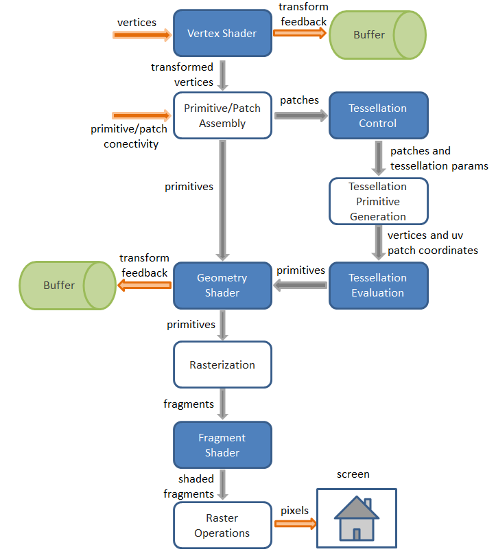

## Qu'est ce qu'un pipeline

Un pipeline est une suite d'opérations appliquées en parallèle sur des données d'entrée pour produire un résultat. Un peu trop général comme définition non ? Dans le cas de la 3D les données d'entrée sont les triangles, décrits par leurs sommets (vertices), eux-même décrits par leurs attributs (position, normale, couleur, coordonnée de texture, etc.). Le résultat est l'image affichée à l'écran.

Voici une illustration du pipeline OpenGL 3+ :

[Et un lien vers une version détaillée](http://www.g-truc.net/doc/OpenGL%204.3%20Pipeline%20Map.pdf) que vous pouvez imprimer, accrocher dans votre chambre et apprendre par coeur (haha...).

## Les stages programmables

Sur le schéma, certains stages sont en bleu. Cela indique qu'ils sont **programmables**. Un stage programmable doit être codé par le.a développeur.euse qui utilise OpenGL. En gros l'algorithme des stages en blanc est fixé, alors que vous devez programmer l'algorithme des stages en bleu.

Le code source d'un stage programmable est un **shader**. Pour développer un shader, on utilise un langage de shading. Nous utiliserons le langage **GLSL**, qui ressemble beaucoup au C. Nous aurons donc deux types de code source:

- Le code source écrit en C++ qui constitue votre programme. Après compilation ce code est executé par votre CPU.
- Le code source écrit en GLSL qui consitue vos shaders. Les shaders sont compilés en utilisant des fonctions OpenGL et sont ensuite executés par le GPU.

Sans shader, vous ne pourrez pas faire grand chose à part de la 2D blanche...

Les shaders permettent une grande modularité, c'est grâce à eux que les graphismes des jeux actuels sont aussi beaux. En contrepartie il devient beaucoup plus compliqué de faire des choses simples en OpenGL. Nous reviendrons plus en détail sur les shaders durant les TPs qui leurs sont consacrés.

La notion de shader restera très floue pour vous tant que vous n'aurez pas pratiqué.
