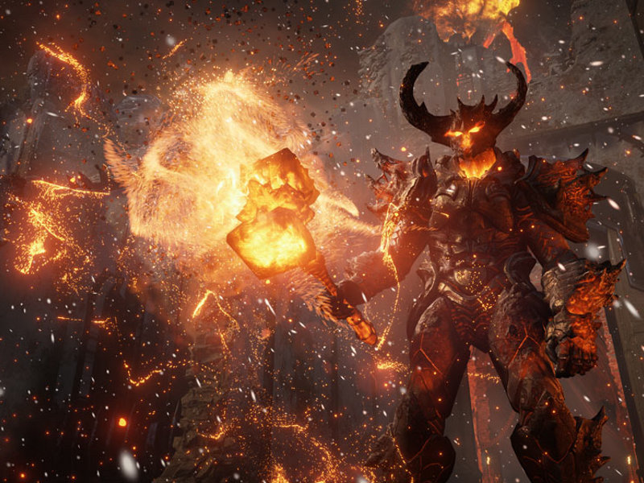

#### OpenGL3+ | Embrace the 3D wizardry

Bienvenue dans le merveilleux monde de la 3D. Ici vous apprendrez que parfois les maths ça sert et même qu'on peut faire de jolies choses avec.

Malheureusement pour cela il faudra affronter un ennemi puissant. Vous l'avez sans doute déjà rencontré dans sa version 2. Cette raclure est de retour, plus fort que jamais.

Mais n'ayez crainte, votre serviteur est là pour vous apprendre à dresser la bête. À la fin de votre entraînement vous combattrez en équipe OpenGL 3 et libérerez ainsi la beauté de la 3D.

